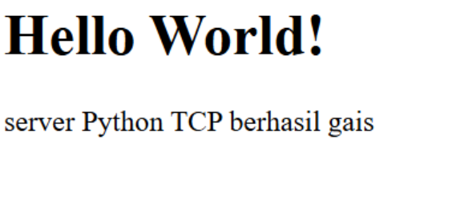

## ARYA BARIQ - 103072400132 - IF0405
# MODUL 9 : WEB SERVER
## Web Server
Web server adalah salah satu elemen utama dalam sistem komunikasi di internet. Fungsinya adalah menerima permintaan dari klien, seperti browser, lalu memberikan tanggapan berupa halaman web atau data sesuai yang diminta. Dalam proses tersebut, komunikasi biasanya menggunakan protokol HTTP (HyperText Transfer Protocol) yang berjalan di atas TCP (Transmission Control Protocol).

## Web Server Sederhana
**Langkah-langkah**
1. Membuat file serverweb.py
2. Tulis code
```python
from socket import *
import sys

# membuat socket server (TCP)
serverSocket = socket(AF_INET, SOCK_STREAM)

# Prepare a server socket
serverPort = 6789
serverSocket.bind(('', serverPort))
serverSocket.listen(1)

while True:
    # Establish the connection
    print('Ready to serve...')
    connectionSocket, addr = serverSocket.accept()

    try:
        # menerima request dari client
        message = connectionSocket.recv(1024).decode()
        print(message)

        # mengambil nama file
        filename = message.split()[1]

        # membuka file
        f = open(filename[1:])
        outputdata = f.read()

        # Send HTTP header
        connectionSocket.send("HTTP/1.1 200 OK\r\n".encode())
        connectionSocket.send("Content-Type: text/html\r\n".encode())
        connectionSocket.send("\r\n".encode())

        # kirim isi file
        for i in range(len(outputdata)):
            connectionSocket.send(outputdata[i].encode())

        connectionSocket.send("\r\n".encode())
        connectionSocket.close()

    except IOError:
        # kirim 404 jika file tidak ada
        connectionSocket.send("HTTP/1.1 404 Not Found\r\n".encode())
        connectionSocket.send("Content-Type: text/html\r\n".encode())
        connectionSocket.send("\r\n".encode())
        connectionSocket.send("<html><body><h1>404 Not Found</h1></body></html>".encode())

        # tutup koneksi
        connectionSocket.close()

serverSocket.close()
sys.exit()
```
3. Buat file HelloWorld.html di folder yang sama
4. Isi dengan
```html
<html>
<head>
    <title>Test Server</title>
</head>
<body>
    <h1>Hello World!</h1>
    <p>server Python TCP berhasil gais</p>
</body>
</html>
```
5. Jalankan program melalui terminal dengan perintah `py serverweb.py`
6. Setelah itu, buka browser dan akses alamat: [http://localhost:6789/HelloWorld.html](http://localhost:6789/HelloWorld.html)
7. Kemudian buka tab baru di browser dan masukkan URL: [http://localhost:6789/salah.html](http://localhost:6789/salah.html)

Program membuat socket TCP dengan library `socket`, lalu server *listening* menunggu koneksi. Saat klien terhubung, server membaca request HTTP dan mengambil file yang diminta. Jika ada, dikirim respons **200 OK**; jika tidak, **404 Not Found**. Program ini *single-threaded*, jadi hanya melayani satu request dalam satu waktu.

**Hasil Percobaan**
Disini server berhasil menampilkan isi file HTML pada browser.


Pada percobaan kedua, server menampilkan pesan **"404 Not Found"**, yang menandakan bahwa server mampu menangani permintaan yang tidak ditemukan dengan baik serta memproses error secara tepat.


## Latian Web Tambahan (Multithreaded Server)
**Langkah-langkah**
1. Membuat file server.py
2. Tulis code
```python
from socket import *
import threading

def handle_client(connectionSocket):
    try:
        # menerima pesan user
        message = connectionSocket.recv(1024).decode() # decode = 10101010 = "message"

        # index.html, hello.html
        # message isinya = /GET /index.html HTTP/1.1
        message = message[4:15]
        print(message)
        # filename = message.split()[1]

        # membuka index.html serta menghilangkan "/"
        f = open(message[1:])

        # membaca file html
        outputData = f.read()

        # kirim respon
        connectionSocket.send(
            "HTTP/1.1 200 OK\r\n\r\n".encode()
        )

        # kirim data
        connectionSocket.sendall(outputData.encode())

        # tutup koneksi
        connectionSocket.close()
    
    except IOError:
        # kirim respon bila tidak ditemukan
        connectionSocket.send(
            "HTTP/1.1 404 Not Found\r\n\r\n".encode()
        )

        # kirim data
        connectionSocket.send(
            "<h1>404 Not Found</h1>".encode()
        )

        # tutup koneksinya
        connectionSocket.close()


serverSocket = socket(AF_INET, SOCK_STREAM)
serverSocket.bind(('', 6789))
serverSocket.listen(5) # dapat menerima sebanyak 5 client
print("[SYSTEM] server is running...")

while True:
    connectionSocket, addr =  serverSocket.accept()

    # membuat thread dan target threadnya, beseerta parameter
    thread = threading.Thread(
        target = handle_client,
        args = (connectionSocket,)
        )
    # menjalankan
    thread.start()
```
3. Buat file index.html di folder yang sama
4. Isi dengan
```html
<h1>YAUDAH</h1>
```
5. Jalankan program melalui terminal dengan perintah `py server.py`
6. Kemudian buka browser dan akses alamat: [http://localhost:6789/index.html](http://localhost:6789/index.html)

Pada versi ini, server menerapkan *multithreading* sehingga dapat melayani banyak klien secara bersamaan. Setiap koneksi akan dibuatkan thread baru yang menjalankan fungsi `handle_client()`. Dengan cara ini, server tidak perlu menunggu satu proses selesai untuk menangani klien lain, sehingga kinerjanya lebih efisien.

**Hasil Percobaan**


Saat beberapa browser atau tab dibuka bersamaan, semua permintaan tetap bisa diproses dengan lancar oleh server.

## Kesimpulannya
Pada percobaan awal, berhasil dibuat server web sederhana yang mampu menerima request HTTP dan memberikan respons sesuai dengan file yang diminta.
Pada tahap berikutnya, server ditingkatkan dengan menerapkan *multithreading* sehingga dapat melayani beberapa permintaan sekaligus. Penerapan ini membuktikan bahwa penggunaan thread dapat meningkatkan kinerja server dalam menangani banyak klien secara bersamaan.
